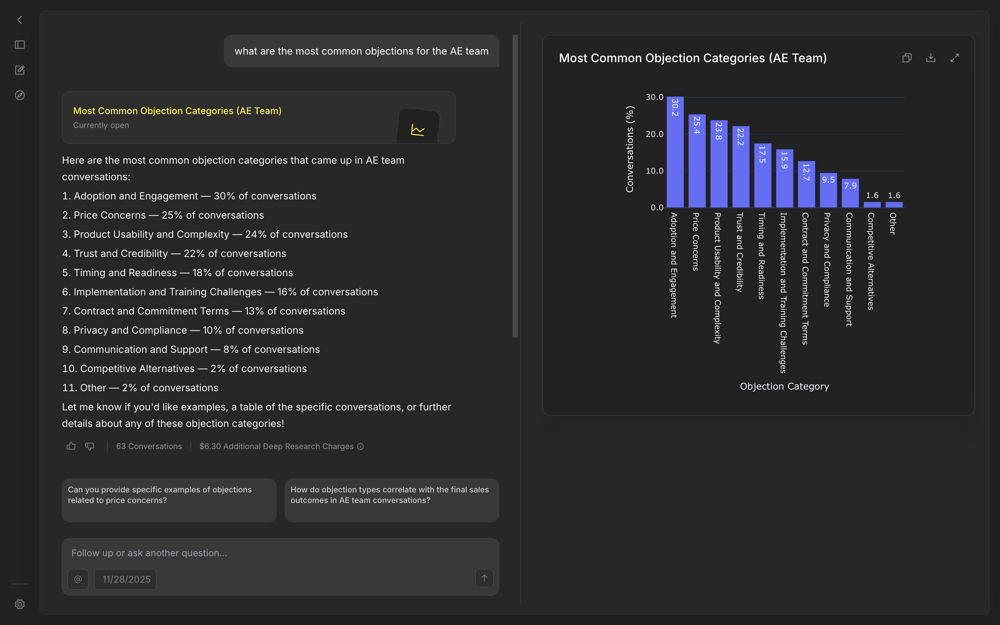

+++
title = "Generating arbitrary interactive charts with LLMs"
date = 2025-11-29
+++

At Rilla, we have an AI Agent called _Rick_ that our customers can use to analyze and visualize all of their data.
The visualizations created by our customers range from simple bar or line charts all the way to to combinations or even radar charts.



All the analysis happens inside an E2B sandbox. They provide convenience methods to detect matplotlib charts and automatically generate [static or interactive plots](https://e2b.dev/docs/code-interpreting/create-charts-visualizations).

ChatGPT works very similarly. If you ask it to generate basic charts, it will display the matplotlib image by default and also allow you to switch to an interactive chart. https://chatgpt.com/share/692b2c9d-1f64-800f-a11f-e2c4d9864aa7

I didn't like this approach for two main reasons

1. The default image is not responsive, not interactive, and quite frankly just ugly
2. Only very basic charts are supported in interactive mode. Each type needs to be handled separately by both backend and frontend, and as soon as you deviate from the basics it can't be interatvie anymore.

I wanted an approach that is very easy to understand for the LLM, allows any chart to be interactive, looks good and is customizable if needed.
After evaluating a few options, I decided to go with plotly.
It is similarly popular as matplotlib and the LLMs I tested had no trouble at all to use it without any extra guidelines.
Plotly Express makes it easy to get decent looking charts out of the box. 
And most importantly, they have frontend libraries that use the same data format as their python library.

The approach I landed on was have the LLM generate an arbitrary chart using Plotly, serialize it to JSON, store it in postgres (metadata) + S3 (plot data), send a presigned URL to the frontend, and display it there with [React Plotly.js](https://plotly.com/javascript/react/).

For the first step, I gave the agent a helper function inside the code environment. It takes in an arbitrary plotly figure, saves it to a file inside the sandbox, and prints out the filepath.

```python
def display_chart(fig: Figure) -> None:
    artifacts_dir = Path("artifacts")
    artifacts_dir.mkdir(exist_ok=True)

    filepath = artifacts_dir / f"chart_{uuid4()}.json"

    with open(filepath, "w", encoding="utf-8") as f:
        f.write(fig.to_json())

    print(f"<artifact>{filepath}</artifact>")
```

Back in the agent loop, I use a simple regex to parse the log lines to extract the filenames and download them from the sandbox.

```python
pattern = r"<artifact>(.*?)</artifact>"
artifact_filenames = [
    filename
    for line in execution.logs.stdout
    for filename in re.findall(pattern, line)
]
artifact_contents = await asyncio.gather(
    *[sbx.files.read(file) for file in artifact_filenames]
)
```

With this setup, the LLM can generate arbitrary charts and display them to the user.
```python
fig = px.bar(
    grouped,
    x='Sales Rep',
    y='Number of Conversations',
    title='Number of Conversations per Sales Rep',
    labels={'Sales Rep': 'Sales Rep', 'Number of Conversations': 'Number of Conversations'},
    text='Number of Conversations'
)
display_chart(fig)
```
On the frontend we load the plot data and display it with React Plotly. We also add some theming and customization to make it look better.
